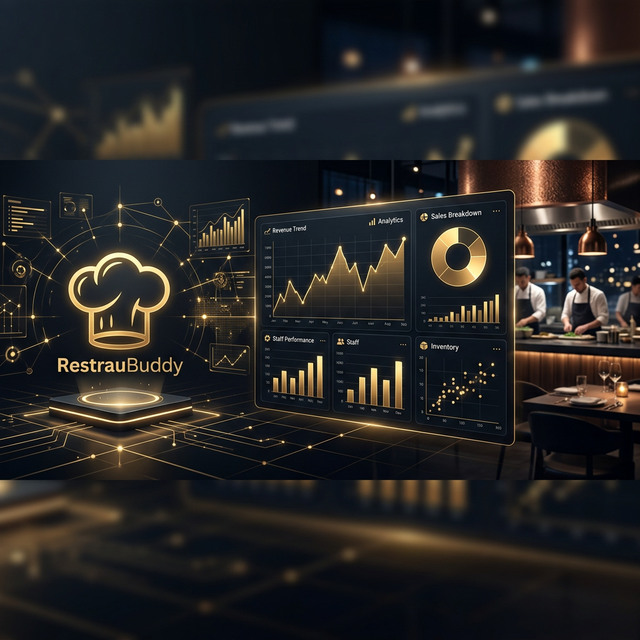

# 🐍 RestrauBuddy - Backend API



The backend for RestrauBuddy is a lightweight Python Flask service that hosts the Machine Learning model and provides prediction endpoints for the frontend.

## 🚀 Features

- **Demand Prediction API**: Provides quantity forecasts for specific dishes based on historical data.
- **Wait Time Estimation**: (In Development) Predictive modeling for kitchen and table wait times.
- **Seamless Integration**: Designed to be consumed by the React frontend.

## 🛠️ Tech Stack

- **Language**: [Python 3.x](https://www.python.org/)
- **Framework**: [Flask](https://flask.palletsprojects.com/)
- **ML Libraries**: [Scikit-learn](https://scikit-learn.org/), [Pandas](https://pandas.pydata.org/), [Joblib](https://joblib.readthedocs.io/)
- **Web Server**: [Gunicorn](https://gunicorn.org/) (for production)

## 🏁 Getting Started

### Setup Environment

1. Navigate to the backend directory:
   ```bash
   cd RestrauBuddy/backend
   ```

2. Create a virtual environment:
   ```bash
   python -m venv venv
   source venv/bin/activate  # On Windows: venv\Scripts\activate
   ```

3. Install dependencies:
   ```bash
   pip install -r requirements.txt
   ```

### Running the Server

1. Start the Flask application:
   ```bash
   python app.py
   ```
   The API will be available at `http://localhost:5001`.

## 📡 API Endpoints

### `POST /predict`
Predicts demand for various dishes based on customer count and other factors.

**Request Body:**
```json
{
  "customers": 150,
  "is_festival": true,
  "unexpected_surge": false,
  "date": "2024-03-25"
}
```

**Successful Response:**
```json
{
  "date": "2024-03-25",
  "customers": 150,
  "recommendations": [
    { "dish": "Biryani", "predicted_quantity": 45, "status": "High Demand" },
    ...
  ],
  "summary": "Targeting 150 customers on a Weekday."
}
```
